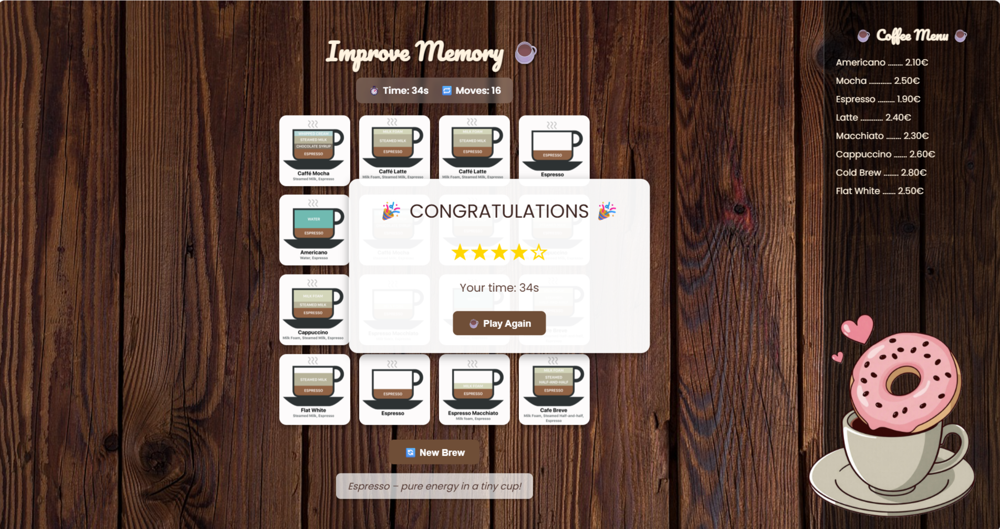
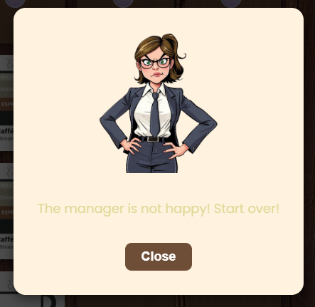

# ☕ Coffee Memory Game

Welcome to **Coffee Memory Game** — a fun, cozy browser game designed to test your memory while enjoying a cup of coffee!  
Flip the cards, match pairs, and beat the clock before the impatient customer calls the manager. 😄

---

## 🎮 **How to Play**

1. Click on two coffee cards to flip them.
2. Try to match all pairs as fast as you can.
3. The faster you finish, the more ⭐ stars you earn!
4. If you take too long... well, let’s just say the *manager* won’t be happy 😬

---
## 🕹️ **Gameplay Preview**

### ✅ Successfully Completed Game
When you match all pairs under time pressure, you’ll see a centered **Congratulations** popup  
showing your **star rating** and total time.



---

## 🌟 **Features**

- 🧠 **Memory gameplay** — classic card-flipping mechanics  
- ☕ **Coffee-themed cards** — Americano, Latte, Mocha, and more  
- 💬 **Speech bubbles** — impatient customer comments as time passes  
- 👩‍💼 **Manager popup** — appears if you’re too slow  
- ⭐ **Star rating system** — based on your finishing time  
- 🎵 **Smooth animations** and soft design using Poppins & Pacifico fonts  

---


### ⚠️ Manager Popup
If time exceeds 65 seconds, the *Manager* appears with a warning and an option to restart the game.



---

### 💬 Chat / Speech Bubbles
During the game, you’ll see fun speech bubbles appear on the left as the “customer” gets impatient.


---

## ⚙️ **Setup Instructions**

 Download or clone this repository:
   ```bash
   git clone https://github.com/yourusername/coffee-memory-game.git

Credits:
Background photo: Unsplash
